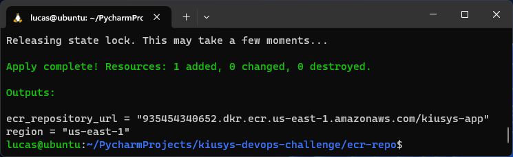
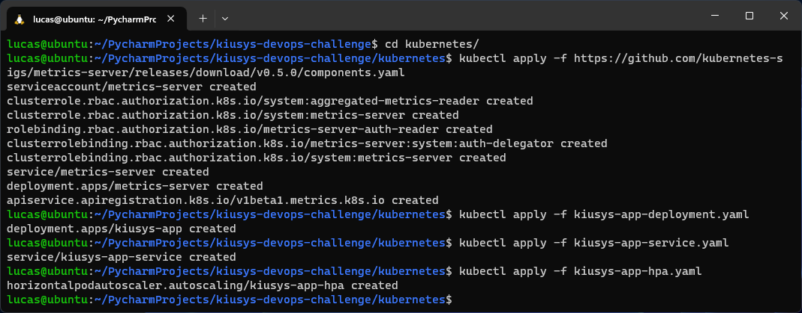

# Kiusys - DevOps Challenge

This repo contains my proposed solution to the DevOps technical challenge at Kiusys.

The instructions of this challenge can be found at [challenge-instructions/Kiu - DevOps Practical Assignment.pdf](challenge-instructions/Kiu%20-%20DevOps%20Practical%20Assignment.pdf)

I followed these steps in order to complete the challenge:

* [1. Design the Application](#1-design-the-application)
* [2. Design the Architecture](#2-design-the-architecture)
* [3. Set up the Terraform remote S3 backends](#3-set-up-the-terraform-remote-s3-backends)
* [4. Provision the database](#4-provision-the-database)
* [5. Provision the Kubernetes cluster in EKS](#5-provision-the-kubernetes-cluster-in-eks)
* [6. Set up kubectl](#6-set-up-kubectl)
* [7. Build and push the app Docker image to ECR](#7-build-and-push-the-app-docker-image-to-ecr)
* [8. Deploy the app to the EKS cluster](#8-deploy-the-app-to-the-eks-cluster)
* [9. Verify the app is working](#9-verify-the-app-is-working)
* [10. Generate documentation using terraform-docs](#10-generate-documentation-using-terraform-docs)
* [11. Destroy the infrastructure](#11-destroy-the-infrastructure)

---

### 1. Design the Application

Since the challenge does not specify an application to be deployed, I have come up with the following app idea:

Kiusys give support to different airlines by handling their reservation system.

Imagine Kiusys is interested on checking how many transactions are made per flight route, independently of how many seats are reserved and/or cancelled in each transaction.

*1 transaction = 1 person reserving 1 seat =  1 person reserving 4 seats = 1 person cancelling 3 seats*

In order to accomplish this, I propose to design an application that has 2 endpoints:
* Record transaction endpoint: Whenever a reservation system confirms a transaction, it hits the endpoint with the flight route ID in order to update the DB.
* Check transactions endpoint: Use this endpoint to check the current number of transactions for a specific flight route ID.

---

### 2. Design the Architecture

* The application will use **Python FastAPI** framework to serve the required endpoints and connect to the database.
  * The application code is located at [kiusys-app/kiusys_app.py](kiusys-app/kiusys_app.py)

<br>

* The challenge also requires that **Terraform** is used to provision all necessary cloud resources. I have decided to use Terraform with remote **S3 backends** since it offers several benefits:
  * Centralized State: Keeps Terraform state in a centralized location, reducing conflicts.
  * Concurrent Collaboration: Enables multiple team members to collaborate concurrently with state locking.
  * Security: Provides access controls and encryption for secure state storage.
  * Durability and Availability: Leverages S3's high durability and availability.
  * Versioning: Allows versioning of the Terraform state for auditing and recovery.
    * Related code is located at [s3-backends](s3-backends)

<br>

* I decided to use a **DynamoDB** NoSQL database with a "key:value" structure where the key will be the flight number and the value the record of transactions. Using DynamoDB offers the following benefits:
  * Managed Service: AWS handles infrastructure, letting you focus on development.
  * Automatic Scaling: DynamoDB adjusts capacity automatically to handle traffic spikes.
  * High Availability: Data is replicated across Availability Zones for fault tolerance.
  * Data Replication and Backup: Supports cross-region replication and provides backup options.
  * Pay-per-Use Pricing: Cost-effective with a pay-as-you-go model.
  * Security: Offers encryption at rest/in transit.
    * Related code is located at [dynamodb](dynamodb)

<br>

* The challenge requires that the application is deployed into a Kubernetes cluster to be easily and seamlessly scalable. I decided to use **AWS EKS (Elastic Kubernetes Service)** since it offers several benefits for deploying and managing Kubernetes clusters on AWS:
  * Managed Control Plane: AWS EKS handles the Kubernetes control plane, ensuring high availability and automatic update.
  * Simplified Management: EKS simplifies cluster management tasks, allowing focus on applications rather than infrastructure.
  * Integration with AWS: Seamless integration with various AWS services for easier application development.
  * Scalability: Automatic scaling of worker nodes based on application demands.
  * High Availability: Designed for high availability, distributing across multiple Availability Zones.
  * Security: Integration with AWS IAM and native Kubernetes RBAC (Role-based access control) for secure access control.
    * Related code is located at [eks-cluster](eks-cluster)

<br>

* Providing **High Availability**
  * The underlying VPC where the EKS cluster will run contains 3 Availability Zones with one public and private subnets.
    * Related code is located at [eks-cluster/vpc.tf](eks-cluster/vpc.tf)

<br>

* Providing **Scalability** and **Fault Tolerance**:
  * 2 worker node groups have been configured with specified minimum and maximum values. 
    * Related code is located at [eks-cluster/eks.tf](eks-cluster/eks.tf)
  * A HorizontalPodAutoscaler (HPA) policy has been configured to automatically scale the number of running pods based on CPU utilization, providing a **LoadBalancer** at the same time.
    * Related code is located at [kubernetes/kiusys-app-hpa.yaml](kubernetes/kiusys-app-hpa.yaml)

<br>

* Providing **Security**:
  * The EKS worker nodes are given an IAM policy that enables them to only Query and AddItem into the flights-db
    * Related code is located at [eks-cluster/iam.tf](eks-cluster/iam.tf)

<br>

* I have used **Docker** alongside [kiusys-app/Dockerfile](kiusys-app/Dockerfile) to build and push the app Docker image into **AWS ECR (Elastic Container Registry)** since it can handle the availability, security and storage-scalability of the Docker images within AWS.
  * Related code is located at [ecr-repo](ecr-repo)

<br>

* In order to manage and deploy the application from ECR into the EKS cluster, I have decided to use **kubectl**.
  * Related kubernetes manifests are located at [kubernetes](kubernetes)


---

### 3. Set up the Terraform remote S3 backends

I have prepared the Terraform configuration code required to create the **eks-cluster**, **dynamodb** and **ecr-repo** backends at [s3-backends](s3-backends).

The steps to set up these backends are the following:

````bash
Navigate to the s3-backends directory:
$ cd s3-backends

Initialize Terraform:
$ terraform init

Check the infrastructure plan:
$ terraform plan

Apply the infrastructure changes:
$ terraform apply
````


---

### 4. Provision the database

I have prepared the Terraform configuration code required to provision the database at [dynamodb](dynamodb)

The "PAY_PER_REQUEST" billing mode will let AWS autoscale the database based on an on-demand mode as per the official documentation: 
* https://docs.aws.amazon.com/amazondynamodb/latest/developerguide/HowItWorks.ReadWriteCapacityMode.html
* https://docs.aws.amazon.com/amazondynamodb/latest/APIReference/API_BillingModeSummary.html

The code at [dynamodb/backend.tf](dynamodb/backend.tf) will indicate Terraform to use the S3 backend previously created.

The steps to set up these backends are the following:

````bash
Navigate to the dynamodb directory:
$ cd dynamodb

Initialize Terraform:
$ terraform init

Check the infrastructure plan:
$ terraform plan

Apply the infrastructure changes:
$ terraform apply
````


---

### 5. Provision the Kubernetes cluster in EKS

My main source of information for this part of the challenge was the official Terraform-EKS documentation : https://developer.hashicorp.com/terraform/tutorials/kubernetes/eks

I have prepared the Terraform configuration code required to create the **eks-cluster** and the underlying **vpc** at the folder [eks-cluster](eks-cluster)

The code at [eks-cluster/backend.tf](eks-cluster/backend.tf) will indicate Terraform to use the S3 backend previously created.

The steps to set up the EKS cluster are the following:

````bash
Navigate to the eks-cluster directory:
$ cd eks-cluster

Initialize Terraform:
$ terraform init

Check the infrastructure plan:
$ terraform plan

Review and Apply the infrastructure changes:
$ terraform apply
````


---

### 6. Set up kubectl


To install **kubectl** I have used the following script based on the official Kubernetes documentation: https://kubernetes.io/docs/tasks/tools/install-kubectl-linux/#install-kubectl-binary-with-curl-on-linux


``install_kubectl.sh``
````bash
#!/bin/bash

curl -LO "https://dl.k8s.io/release/$(curl -L -s https://dl.k8s.io/release/stable.txt)/bin/linux/amd64/kubectl"

sudo install -o root -g root -m 0755 kubectl /usr/local/bin/kubectl

kubectl version --client
````

After provisioning the EKS cluster, I use the AWS CLI and Terraform outputs to configure kubectl:

`````bash
Navigate to "eks-cluster" to use the Terraform outputs
$ cd eks-cluster

Update kubect configuration
$ aws eks --region $(terraform output -raw region) update-kubeconfig \
    --name $(terraform output -raw cluster_name)
`````


Once it's configured, I can verify if the cluster is working as expected:

`````bash
$ kubectl cluster-info

$ kubectl get nodes
`````


---

### 7. Build and push the app Docker image to ECR

I have prepared the Terraform configuration code required to provision the database at [ecr-repo](ecr-repo)

The code at [ecr-repo/backend.tf](ecr-repo/backend.tf) will indicate Terraform to use the S3 backend previously created.

The steps to set up the ECR cluster are the following:

````bash
Navigate to the ecr-repo directory:
$ cd ecr-repo

Initialize Terraform:
$ terraform init

Check the infrastructure plan:
$ terraform plan

Review and Apply the infrastructure changes:
$ terraform apply
````



In order to build and push the application Docker image to ECR I run the following commands from the root folder:

````bash
Navigate to the Dockerfile location
$ cd kiusys-app

Build the Docker image
$ docker build -t kiusys-app:latest .

Navigate to "ecr-repo" to use the Terraform outputs
$ cd .. && cd ecr-repo

Authenticate Docker to ECR registry
This command retrieves an authentication token and configures your local Docker client to use it.
$ aws ecr get-login-password --region $(terraform output -raw region) | docker login --username AWS --password-stdin $(terraform output -raw ecr_repository_url)

Tag the Docker image with the ECR repository
$ docker tag kiusys-app:latest $(terraform output -raw ecr_repository_url):latest

Push the Docker image to ECR
$ docker push $(terraform output -raw ecr_repository_url):latest
````


---

### 8. Deploy the app to the EKS cluster

In order to deploy the application I run the following commands from the root folder:

````bash
Navigate to "kubernetes" to use the Terraform outputs
$ cd kubernetes/

Install the kubernetes-metrics-server for cluster monitoring, required to enable HPA 
$ kubectl apply -f https://github.com/kubernetes-sigs/metrics-server/releases/download/v0.5.0/components.yaml

Deploy the application
$ kubectl apply -f kiusys-app-deployment.yaml

Deploy the service for the application
$ kubectl apply -f kiusys-app-service.yaml

Apply Horizontal Pod Autoscaler (HPA)
$ kubectl apply -f kiusys-app-hpa.yaml
````



---

### 9. Verify the app is working

Getting the publicly accessible domain:


Accessing the external-ip with the browser:


Saving a transaction for the flight route **AR1133**:


If I click 5 times on the Execute, the record increments:


Using the other endpoint to get the record for the flight route **AR1133**


Using the other endpoint to get the record for the flight route **LA0001**


---

### 10. Generate documentation using terraform-docs

I used **terraform-docs** in order to document all the Terraform code I have written for this project.

1. I installed it following the official steps: https://terraform-docs.io/user-guide/installation/
2. Executed the [terraform-docs.sh](terraform-docs.sh) script:

````bash
#!/bin/bash

terraform-docs markdown ./dynamodb > ./dynamodb/README.md
terraform-docs markdown ./ecr-repo > ./ecr-repo/README.md
terraform-docs markdown ./eks-cluster > ./eks-cluster/README.md
terraform-docs markdown ./s3-backends > ./s3-backends/README.md
````

---

### 11. Destroy the infrastructure

These are the steps I followed to destroy all the infrastructure created for this challenge:


#### 1. Destroy the ECR Repo

````bash
Navigate to "ecr-repo"
$ cd ecr-repo

Terraform cannot destroy the kiusys-app ECR Repository if it is not empty. 
You are required to delete the images inside.
$ aws ecr batch-delete-image --repository-name kiusys-app --image-ids imageTag=latest

Terraform destroy
$ terraform destroy -auto-approve
````


#### 2. Destroy the database
````bash
Navigate to "dynamodb"
$ cd dynamodb

Terraform destroy
$ terraform destroy -auto-approve
````

#### 3. Destroy the EKS cluster
````bash
Navigate to "eks-cluster"
$ cd eks-cluster

Terraform destroy
$ terraform destroy -auto-approve
````
I have experienced long time destroying the following infrastructure:
* module.vpc.aws_internet_gateway
* module.vpc.aws_subnet.public

I have read that it could be related to Terraform not being aware of the LoadBalancer and Security Group created by the EKS cluster.

While Terraform was spinning, I tried deleting the VPC from the AWS Console it said that I was not able to do it since it contained network interfaces. 
I then manually deleted both the LoadBalancer and Security Group using the AWS Console.

After this, Terraform stopped spinning and completed the ``terraform destroy`` command:

    Destroy complete! Resources: 62 destroyed.


#### 4. Destroy the S3 backends
````bash
Navigate to "s3-backends"
$ cd s3-backends

Terraform destroy
$ terraform destroy -auto-approve
````

#### 5. Remove all Docker data
````bash
$ docker system prune --all --force --volumes
````


